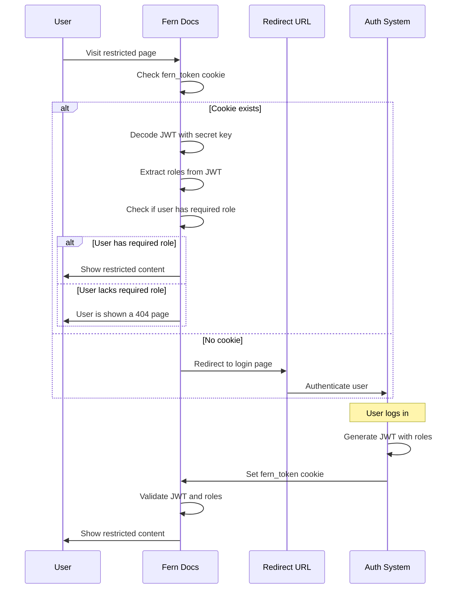

<Note>RBAC is part of the pro plan.</Note>

## Introduction

Fern allows you to restrict parts of your navigation to individuals with specific roles. RBAC enables you to create different levels of access for different user types within your documentation.

### Use cases

Role-based access control is helpful for scenarios such as:

- **Partner documentation**: Provide exclusive API documentation to integration partners while keeping internal docs private
- **Beta features**: Share new features with beta users before general release
- **Internal documentation**: Restrict sensitive documentation to employees only
- **Tiered access**: Offer different documentation levels based on subscription tiers
- **Customer-specific content**: Show different documentation based on customer type or plan

### How it works

If a user visits content not marked as visible to the `everyone` role, Fern will check for an authentication cookie to indicate what roles that user has. If the user does not have a role matching the viewers of the page, we will redirect them to the URL you provided during setup.

Below, we walk through each of the steps required to configure RBAC.

### Architecture diagram



## Set up RBAC

<Steps>
### Define all the `roles` in your docs.yml

Start by defining all the different roles in your `docs.yml`. You can specify this under a `roles` key:

```yml docs.yml
roles:
 - everyone # every user is given this role
 - partners
 - beta-users
 - admins
```

<Info>
The `everyone` role is special. Every user has this role (including unauthenticated users).
</Info>

### Configure authentication via a `fern_token`

In this step, we will configure authentication so that Fern can understand what roles a particular user has. Fern expects the user's
browser session to have a cookie called `fern_token`. If the cookie is not present, the user will be redirected to your company's
login page.

**You are responsible for creating and setting the `fern_token` cookie in your authentication system.** Upon login, you must set a JWT for the user using a secret key that we will provide. The JWT must have a `fern` claim with a key called `roles`.

```json
{
  "fern": {
    "roles": ["partners"]
  }
}
```

### Contact Fern for setup

When you're ready to implement RBAC, **contact support@buildwithfern.com** to receive your secret key for JWT signing.

You'll also need to provide the URL where Fern should send unauthenticated users to log in.

<Note>Optional: If you'd like restricted pages to be visible but locked to unauthenticated users (rather than completely hidden), let us know during this step.</Note>

</Steps>

### Access control within navigation

You can designate viewers on the following navigation items:
- `products`
- `versions`
- `tabs`
- `sections`
- `pages`
- `api references`
- `changelogs`

If you don't specify viewers, the content will be visible to _any authenticated user_.

```yml docs.yml {6-7, 13-15}
navigation:
  - tab: Home
    layout: 
      - page: Welcome # this page is public
        path: pages/welcome.mdx
        viewer: 
          - everyone 
  - tab: Documentation
    layout:
      - page: Overview # this page is visible to all logged-in users
        path: pages/overview.mdx 
      - section: Beta Release # this section is visible to beta-users and admins
        viewers:
          - beta-users
          - admins
        contents: 
          ...
```

Viewership is inherited. For example, if a section can only be viewed by `admins`, then all its pages and nested sections can also only be viewed by admins.

### Access control within MDX pages

You can restrict specific content within your MDX pages to users with certain roles. This allows you to show different content to different user types on the same page.

#### Basic usage

Use the `<If />` component to conditionally render content based on user roles:

```mdx
<If roles={["beta-users"]}>
  <Callout>
    This callout is only visible to beta users.
  </Callout>
</If>
```

#### Multiple roles

You can specify multiple roles. Content will be visible to users who have **any** of the specified roles:

```mdx
<If roles={["partners", "admins"]}>
  <Callout>
    This content is visible to both partners and admins.
  </Callout>
</If>
```

<Note>
The `<If>` component respects the same role inheritance rules as navigation items. If a user has access to a page, they can see all content on that page that matches their roles.
</Note>
