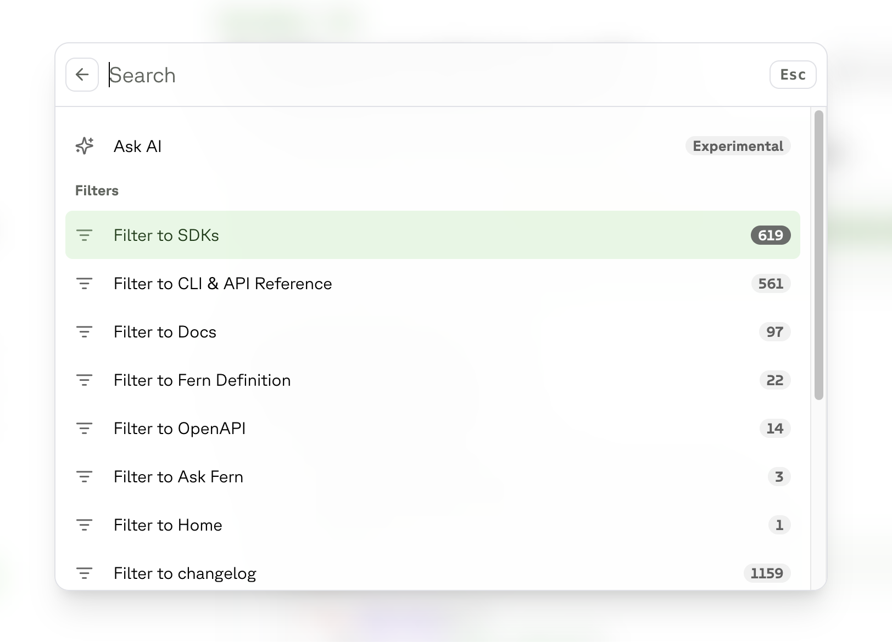

Fern uses [Algolia DocSearch](https://docsearch.algolia.com/) to power search for your documentation. 
DocSearch is designed specifically for documentation sites to help users quickly find what they need.

## How search works

DocSearch scans your Fern site's content and builds an index to generate search results. 
It includes built-in filters that let users refine their searches by content type:

- **Versions:** For sites with separate documentation for different API versions
- **Endpoints:** Filters results by API reference documentation
- **Guides:** Filters results by non-API reference documentation
- **Changelog:** Filters results by changelog updates

If you are using the AI Search feature, the search box also functions as your site's chat window.

<Frame>

</Frame>

<Note>
    **Note:** If an article includes the `nofollow` or `noindex` [frontmatter](/learn/docs/content/frontmatter#indexing-properties), it will not be indexed by Algolia DocSearch and won't appear in search results.
</Note>

## Integrating with Algolia

If you need to integrate Fern's documentation search into your own application or dashboard, you can request Algolia credentials directly from the Fern team. These credentials will allow you to query the same search index that powers your documentation site's search functionality.

### Making Search Requests

Once you have your credentials, you can make requests to Algolia's API to search your documentation.

Contact the Fern team to get your specific application ID and index name. Credentials are provided on a per-customer basis to maintain security.

<Note>
    **Note:** Keep your Algolia credentials secure and avoid exposing them in client-side code. Consider implementing a backend proxy to make the Algolia requests.
</Note>

## Using an alternative search 

You can override Fern's search with your own solution. To learn more, see [Custom JavaScript](/learn/docs/building-and-customizing-your-docs/custom-css-global-js#custom-javascript).