

  {/* Dashed Pattern - Left Side */}
  

  {/* Dashed Pattern - Right Side */}
  

  <h2>Get started</h2>
  
Build a docs site quickly by importing your existing syling and specs.

  <CardGroup cols={2}>
    <a class="fern-card interactive not-prose relative block p-6 text-base" href="/docs/getting-started/quickstart">
      

        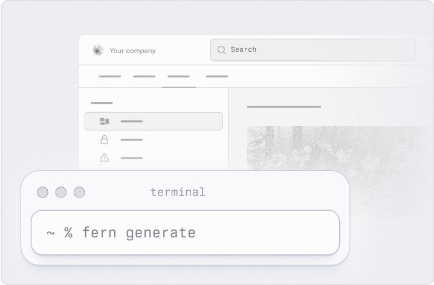
        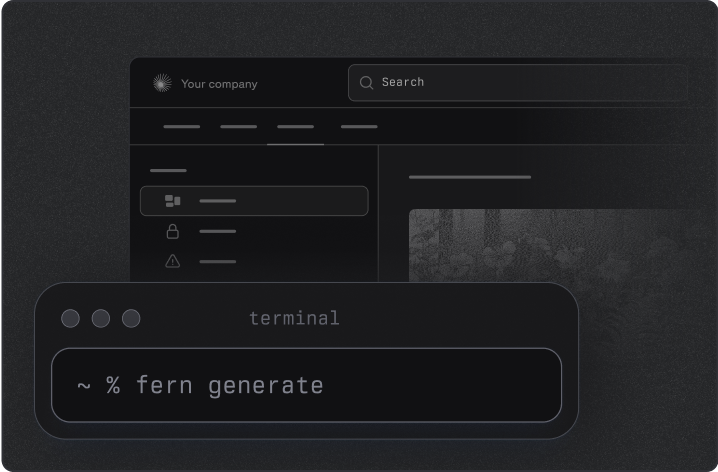
        

          

            Quickstart
            
            
          

          

            
Set up a documentation site in under 5 minutes.

          

        

      

    </a>
    
    <a class="fern-card interactive not-prose rounded-3 relative block border p-6 text-base" href="/docs/configuration/what-is-docs-yml">
      

        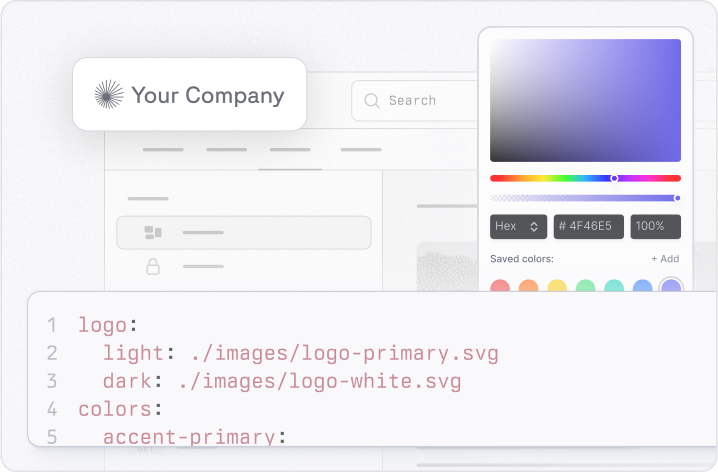
        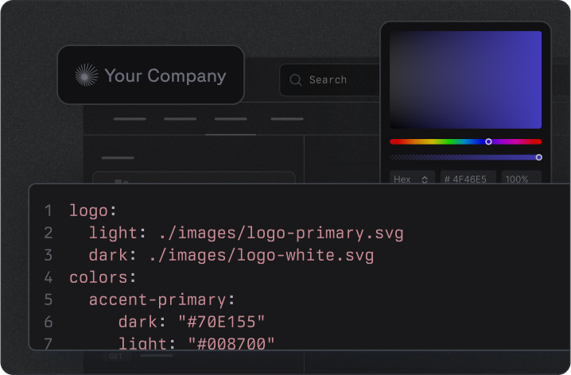
        

          

            Configure with ease
            
            
          

          

            
Use one simple file to generate documentation that fits your brand.

          

        

      

    </a>
  </CardGroup>

  <h2>Features</h2>
  
Build your own components, enable Ask Fern, generate API references, and easily update your docs.

  <CardGroup cols={2}>
    <a class="fern-card interactive not-prose rounded-3 relative block border p-6 text-base" href="/docs/writing-content/components/overview">
      

        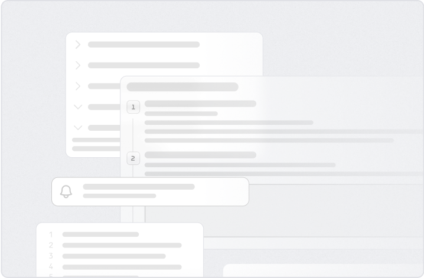
        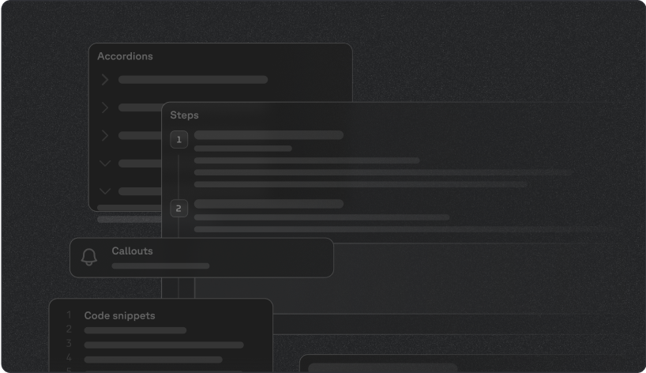
        

          

            Flexible component library
            
            
          

          

            
Use pre-built or custom React components for a polished look.

          

        

      

    </a>
    
    <a class="fern-card interactive not-prose rounded-3 relative block border p-6 text-base" href="/docs/writing-content/visual-editor">
      

        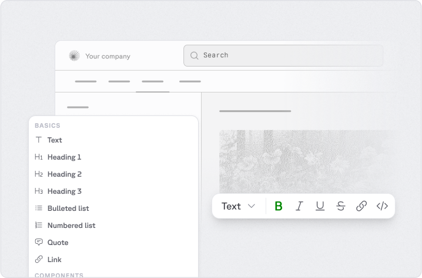
        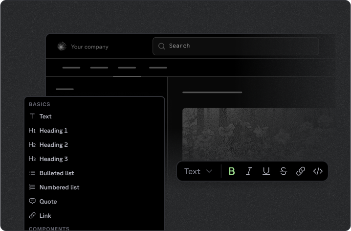
        

          

            Visual Editor
            
            
          

          

            
Modify your documentation without touching code and publish to your GitHub.

          

        

      

    </a>

    <a class="fern-card interactive not-prose rounded-3 relative block border p-6 text-base" href="/docs/api-references/generate-api-ref">
      

        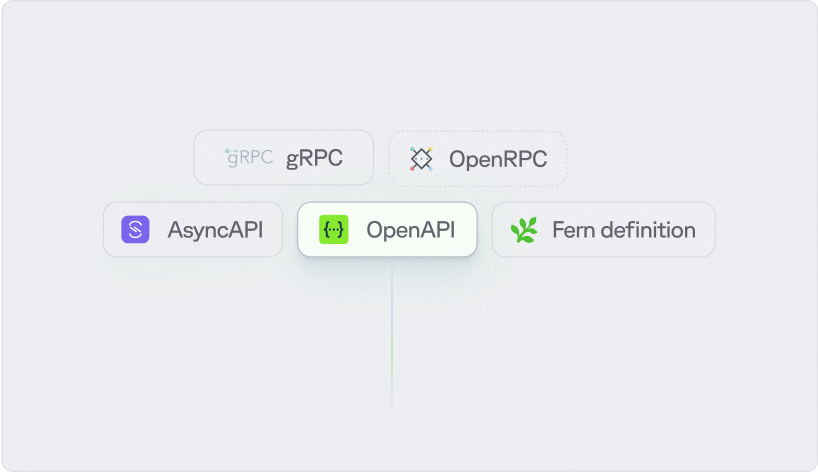
        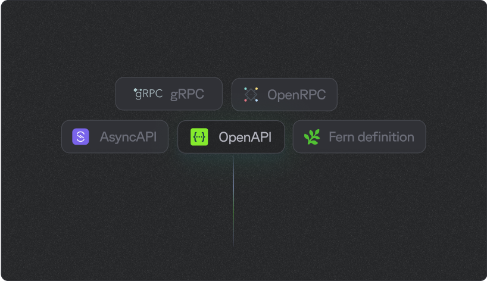
        

          

            Bring your own API Spec
            
            
          

          

            
Use OpenAPI, AsyncAPI, gRPC, OpenRPC, and the Fern spec.

          

        

      

    </a>

    <a class="fern-card interactive not-prose rounded-3 relative block border p-6 text-base" href="/ask-fern/getting-started/what-is-ask-fern">
      

        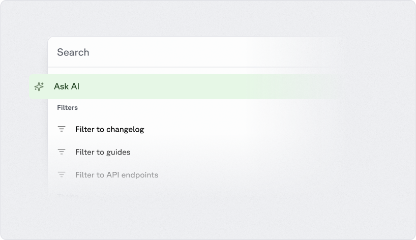
        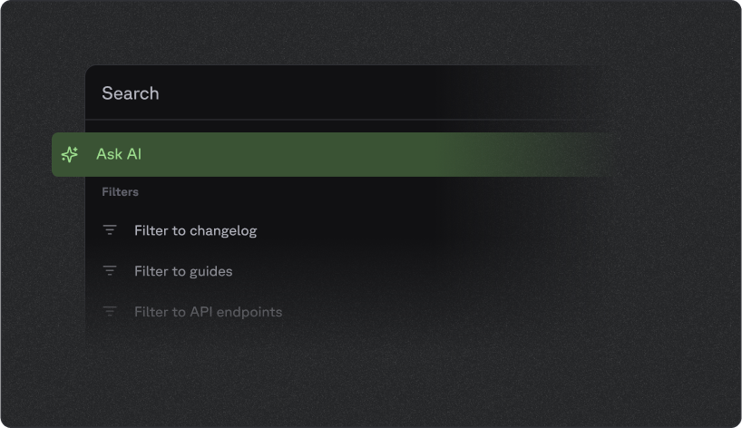
        

          

            Ask Fern
            
            
          

          

            
A personalized chatbot that can answer questions about your documentation.

          

        

      

    </a>
  </CardGroup> 
  

