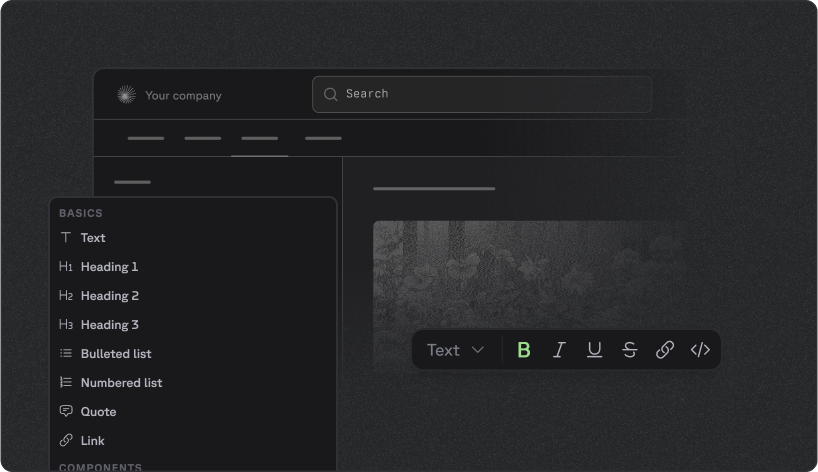

<CardGroup cols={2}>
  <a class="fern-card interactive not-prose rounded-3 relative block border p-6 text-base" href="/docs/guides/getting-started/quickstart">
    

      
      
      

        
Quickstart

        

          
Start building beautiful documentation in under 5 minutes.

        

      

    

  </a>
  
  <a class="fern-card interactive not-prose rounded-3 relative block border p-6 text-base" href="/docs/guides/getting-started/what-is-docs-yml">
    

      
      
      

        
Configure with ease

        

          
One simple file that can be used to generate documentation that fits your brand.

        

      

    

  </a>
  
  <a class="fern-card interactive not-prose rounded-3 relative block border p-6 text-base" href="/docs/component-library/overview">
    

      
      
      

        
Flexible component library

        

          
Use pre-built or custom React components for a polished look.

        

      

    

  </a>
  
  <a class="fern-card interactive not-prose rounded-3 relative block border p-6 text-base" href="/docs/component-library/writing-content/visual-editor">
    

      
      
      

        
Visual Editor

        

          
Modify your documentation without touching code and publish to your GitHub.

        

      

    

  </a>
</CardGroup> 