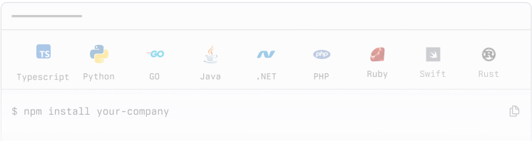

  {/* Dashed Pattern - Left Side */}
  

    

  

  {/* Dashed Pattern - Right Side */}
  

    

  

  {/* Main Content */}
  

    {/* Hero Section */}
    

      

        <h1 className="hero-title">
          Build with Fern
        </h1>
      

    

    {/* Feature Grid */}
    

      {/* SDKs Card */}
      

        

          <h3 className="card-title">SDKs</h3>
          

            Generate client libraries in multiple languages.
          

        

        
        

          
        

        {/* Language Icons */}
        

          Get started with:
          {/* TypeScript */}
          

            Ts
          

          {/* Python */}
          

            Py
          

          {/* Go */}
          

            Go
          

          {/* Java */}
          

            Ja
          

          {/* Ruby */}
          

            Ru
          

          {/* C# */}
          

            C#
          

          {/* PHP */}
          

            PH
          

        

        {/* Action Buttons */}
        

          <button className="btn-primary">
            Quick start
          </button>
          <button className="btn-secondary">
            Capabilities
          </button>
          <button className="btn-secondary">
            Customers
          </button>
        

      

      {/* Docs Card */}
      

        

          <h3 className="card-title">Docs</h3>
          

            A beautiful, interactive documentation website.
          

        

        
        

        

          <button className="btn-primary-start">
            Quickstart
          </button>
          <button className="btn-secondary-start">
            Import your brand language
          </button>
          <button className="btn-secondary-start">
            Add multiple specs to your docs site
          </button>
          <button className="btn-secondary-start">
            Set up tabs
          </button>
          <button className="btn-secondary-start">
            Configure multiple products
          </button>
          <button className="btn-secondary-start">
            Create versions
          </button>
          <button className="btn-secondary-start">
            Customize slug from MDX
          </button>
          <button className="btn-secondary-start">
            See all available components
          </button>
        

      

      {/* AI Search Card */}
      

        

          <h3 className="card-title">AI Search</h3>
          

            Let users find answers in your documentation instantly
          

        

        

        

          <button className="btn-primary">
            Configures
          </button>
          <button className="btn-secondary">
            Customers
          </button>
        

      

    

    {/* Community Section */}
    

      

        <h2 className="section-title">Community</h2>
      

      
      

        

          <h3 className="community-card-title">Changelog</h3>
          

            See our most recent product updates.
          

          

            arrow
          

        

        
 
          <h3 className="community-card-title">Github</h3>
          

            Follow progress and contribute to the codebase.
          

          

            arrow
          

        

        

          <h3 className="community-card-title">Discord</h3>
          

            Connect with the Fern community.
          

          

            arrow
          

        

        

          <h3 className="community-card-title">
            Twitter X
          </h3>
          

            Get updates on the Fern platform.
          

          

            Arrow
          

        

      

    

    {/* Help Section */}
    

      

        <h2 className="help-title">Help</h2>
        

          We're lightning-fast with support - you'll typically hear back from us in hours, not days!
        

      

      
      

        

          File a Github issue
        

        

          Email us
        

        

          Slack (for customers only)
        

      

    

    {/* Footer */}
    <footer className="footer">
      

        {/* Left Column - Logo and Status */}
        

          

            
          

          
          

            

              

              All systems operational
            

            
            

              Soc 2 Type 1
            

          

        

        {/* Right Column - Newsletter Signup */}
        

          

            
Subscribe to our updates

            

              

                
marty.mcfly@hillvalley.edu

              

              <button className="newsletter-button">
              </button>
            

          

        

      

      {/* Footer Links */}
      

        

          <h4 className="footer-column-title">Documentation</h4>
          

            <a href="#" className="footer-link">Introduction</a>
            <a href="#" className="footer-link">OpenAPI Compatibility</a>
            <a href="#" className="footer-link">SDKs</a>
            <a href="#" className="footer-link">Docs</a>
          

        

        

          <h4 className="footer-column-title">Resources</h4>
          

            <a href="#" className="footer-link">Blog</a>
            <a href="#" className="footer-link">Support</a>
            <a href="#" className="footer-link">Pricing</a>
            <a href="#" className="footer-link">Discord</a>
          

        

        

          <h4 className="footer-column-title">Company</h4>
          

            <a href="#" className="footer-link">Brand Kit</a>
            <a href="#" className="footer-link">Github</a>
            <a href="#" className="footer-link">Privacy Policy</a>
            <a href="#" className="footer-link">Terms of Service</a>
          

        

      

    </footer>
  

