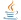

import { FernFooter } from "../../../components/FernFooter";

  

  

  

  

  

  {/* Main Content */}
  

    {/* Dashed Pattern - Left Side */}
    

    {/* Dashed Pattern - Right Side */}
    

    {/* Hero Section */}
    

      

        <h1 className="hero-title">
          Build with Fern
        </h1>
        

          Start with SDKs, Docs, or both.
        

      

    

    {/* Feature Grid */}
    

      {/* SDKs Card */}
      

        

          <a className="card-title" href="/sdks/overview/introduction">
            SDKs
            
            
          </a>
          

            Generate client libraries in multiple languages.
          

        

        
        {/* Rive Animation */}
        

          

            <canvas id="sdk-rive-canvas"></canvas>
          

        

        {/* Language Icons */}
        

          Get started with:
          {/* TypeScript */}
          
          {/* Python */}
           
          {/* Go */}
          
          {/* Java */}
          
          {/* C# */}
          
          {/* PHP */}
          
          {/* Ruby */}
          
        

        {/* Action Buttons */}
        

          <a className="fern-button filled normal primary gap-1 a-btn" href="/sdks/overview/introduction">
            Introduction
            
            
          </a>
          <a className="fern-button minimal normal gap-1 a-btn" href="/sdks/overview/quickstart">
            Quickstart
            
            
          </a>
          <a className="fern-button minimal normal gap-1 a-btn" href="https://buildwithfern.com/showcase">
            Customers
            
            
          </a>
        

      

      {/* Docs Card */}
      

        

          <a className="card-title" href="/docs/getting-started/overview">
            Docs
            
            
          </a>
          

            A beautiful, interactive documentation website.
          

        

        
        {/* Rive Animation */}
        

          <canvas id="docs-rive-canvas"></canvas>
        

        

          <a className="fern-button filled normal primary gap-1 w-fit a-btn" href="/docs/getting-started/overview">
            Introduction
            
            
          </a>
          <a className="fern-button minimal normal w-fit gap-1 a-btn" href="/docs/getting-started/quickstart">
            Quickstart
            
            
          </a>
          <a className="fern-button minimal normal w-fit gap-1 a-btn" href="/docs/writing-content/components/overview">
            See all available components
            
            
          </a>
          <a className="fern-button minimal normal w-fit gap-1 a-btn" href="/docs/customization/what-is-docs-yml"> 
            Configure your docs
            
            
          </a>
          <a className="fern-button minimal normal w-fit gap-1 a-btn" href="/docs/api-references/generate-api-ref">
            Bring your own API spec
            
            
          </a>
          <a className="fern-button minimal normal w-fit gap-1 a-btn" href="/docs/customization/project-structure">
            Setup your project structure
            
            
          </a>
          
        

      

      {/* AI Search Card */}
      

        

          <a className="card-title" href="/ask-fern/getting-started/what-is-ask-fern">
            Ask Fern
            
            
          </a>
          

            AI Search that lets users find answers in your documentation instantly.
          

        

        {/* Rive Animation */}
        

          <canvas id="ai-rive-canvas"></canvas>
        

        

          <a className="fern-button filled normal primary gap-1 a-btn" href="/ask-fern/getting-started/what-is-ask-fern">
            Introduction
            
            
          </a>
          <a className="fern-button minimal normal gap-1 a-btn" href="/ask-fern/configuration/custom-prompting">
            Configure
            
            
          </a>
          <a className="fern-button minimal normal gap-1 a-btn" href="https://buildwithfern.com/showcase">
            Customers
            
            
          </a>
        

      

    

    {/* Community Section */}
    

      

        <h2 className="card-title">Community</h2>
      

      
      

        

          
          

          <h3 className="community-card-title">Changelog</h3>
          

            See our most recent product updates.
          

          

            
            
            {/* Python */}
             
            {/* Go */}
            
            {/* Java */}
            
            {/* C# */}
            
            {/* PHP */}
            
            {/* Ruby */}
            
          

        

        
 
          
          

          <h3 className="community-card-title">Github</h3>
          

            Follow progress and contribute to the codebase.
          

          <a className="fern-button outlined normal gap-1 a-btn" href="https://github.com/fern-api/fern">
            View
          </a>
        

        

          
          

          <h3 className="community-card-title">Slack</h3>
          

            Connect with the Fern community.
          

          <a className="fern-button outlined normal gap-1 a-btn" href="https://buildwithfern.com/slack">
            View
          </a>
        

        

          
          

          <h3 className="community-card-title">
            Twitter X
          </h3>
          

            Get updates on the Fern platform.
          

          <a className="fern-button outlined normal gap-1 a-btn" href="https://x.com/buildwithfern">
            View
          </a>
        

      

    

    {/* Help Section */}
    

      

        <h2 className="card-title">Help</h2>
        

          We're lightning-fast with support! If you're a customer, reach out via your dedicated Slack channel.
        

      

      
      

        <a className="fern-button outlined normal gap-2 a-btn" href="https://github.com/fern-api/fern/issues">
          
          

          File a Github issue
        </a>

        <a className="fern-button outlined normal gap-2 a-btn" href="mailto:support@buildwithfern.com">
          
          

          Email us
        </a>
      

    

  

