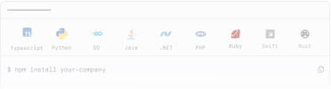

  
 

  
 

  
 

  
 

  
 

  {/* Main Content */}
  

    {/* Dashed Pattern - Left Side */}
    

      

    

    {/* Dashed Pattern - Right Side */}
    

      

    

    {/* Hero Section */}
    

      

        <h1 className="hero-title">
          Build with Fern
        </h1>
        

          Start with SDKs, Docs, or both.
        

      

    

    {/* Feature Grid */}
    

      {/* SDKs Card */}
      

        

          <h2 className="card-title">SDKs</h2>
          

            Generate client libraries in multiple languages.
          

        

        
        

          
        

        {/* Language Icons */}
        

          Get started with:
          {/* TypeScript */}
          
          {/* Python */}
           
          {/* Go */}
          
          {/* Java */}
          
          {/* Ruby */}
          
          {/* C# */}
          
          {/* PHP */}
          
        

        {/* Action Buttons */}
        

          <a className="fern-button filled normal primary gap-1 a-btn">
            Quick start
            
          </a>
          <a className="fern-button minimal normal gap-1 a-btn">
            Capabilities
            
          </a>
          <a className="fern-button minimal normal gap-1 a-btn">
            Customers
            
          </a>
        

      

      {/* Docs Card */}
      

        

          <h2 className="card-title">Docs</h2>
          

            A beautiful, interactive documentation website.
          

        

        
        

        

          <a className="fern-button filled normal primary gap-1 w-fit a-btn">
            Quickstart
            
          </a>
          <a className="fern-button minimal normal w-fit gap-1 a-btn">
            Import your brand language
            
          </a>
          <a className="fern-button minimal normal w-fit gap-1 a-btn">
            Add multiple specs to your docs site
            
          </a>
          <a className="fern-button minimal normal w-fit gap-1 a-btn">
            Set up tabs
            
          </a>
          <a className="fern-button minimal normal w-fit gap-1 a-btn">
            Configure multiple products
            
          </a>
          <a className="fern-button minimal normal w-fit gap-1 a-btn">
            Create versions
            
          </a>
          <a className="fern-button minimal normal w-fit gap-1 a-btn">
            Customize slug from MDX
            
          </a>
          <a className="fern-button minimal normal w-fit gap-1 a-btn">
            See all available components
            
          </a>
        

      

      {/* AI Search Card */}
      

        

          <h2 className="card-title">AI Search</h2>
          

            Let users find answers in your documentation instantly
          

        

        

        

          <a className="fern-button filled normal primary gap-1 a-btn">
            Configure
            
          </a>
          <a className="fern-button minimal normal gap-1 a-btn">
            Customers
            
          </a>
        

      

    

    {/* Community Section */}
    

      

        <h2 className="section-title">Community</h2>
      

      
      

        

          
          <h3 className="community-card-title">Changelog</h3>
          

            See our most recent product updates.
          

          <a className="fern-button outlined normal gap-1 a-btn">
            View
            
          </a>
        

        
 
          
          <h3 className="community-card-title">Github</h3>
          

            Follow progress and contribute to the codebase.
          

          <a className="fern-button outlined normal gap-1 a-btn">
            View
            
          </a>
        

        

          
          <h3 className="community-card-title">Discord</h3>
          

            Connect with the Fern community.
          

          <a className="fern-button outlined normal gap-1 a-btn">
            View
            
          </a>
        

        

          
          <h3 className="community-card-title">
            Twitter X
          </h3>
          

            Get updates on the Fern platform.
          

          <a className="fern-button outlined normal gap-1 a-btn">
            View
            
          </a>
        

      

    

    {/* Help Section */}
    

      

        <h2 className="help-title">Help</h2>
        

          We're lightning-fast with support - you'll typically hear back from us in hours, not days!
        

      

      
      

        <a className="fern-button outlined normal gap-2 a-btn">
          
          File a Github issue
        </a>

        <a className="fern-button outlined normal gap-2 a-btn">
          
          Email us
        </a>

        <a className="fern-button outlined normal gap-2 a-btn">
          
          Slack (for customers only)
        </a>
      

    

    {/* Footer */}
    <footer className="footer">
      

        {/* Left Column - Logo and Status */}
        

          
        

        
        

          

            

            All systems operational
          

          
          

            Soc 2 Type 1
          

        

      

      {/* Footer Links */}
      

        {/* Newsletter Signup */}
        {/* 

          
Subscribe to our updates

          

            

              marty.mcfly@hillvalley.edu
            

            <button className="newsletter-button">
            </button>
          

        
 */}
        

          <h4 className="footer-column-title">Documentation</h4>
          

            <a href="#" className="footer-link">Introduction</a>
            <a href="#" className="footer-link">OpenAPI Compatibility</a>
            <a href="#" className="footer-link">SDKs</a>
            <a href="#" className="footer-link">Docs</a>
          

        

        

          <h4 className="footer-column-title">Resources</h4>
          

            <a href="#" className="footer-link">Blog</a>
            <a href="#" className="footer-link">Support</a>
            <a href="#" className="footer-link">Pricing</a>
            <a href="#" className="footer-link">Discord</a>
          

        

        

          <h4 className="footer-column-title">Company</h4>
          

            <a href="#" className="footer-link">Brand Kit</a>
            <a href="#" className="footer-link">Github</a>
            <a href="#" className="footer-link">Privacy Policy</a>
            <a href="#" className="footer-link">Terms of Service</a>
          

        

      

      {/* 

        
© 2025 Fern • Birch Solutions, Inc.

        
Located in Brooklyn, New York.

      
 */}
    </footer>
  

