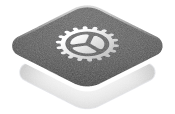

{/* 

  
 

  
 

  
 

  
 

  
 

 */}

# Build with Fern
Start with Docs, SDKs, or both.

<Cards cols={2}>
  

    

      

        
        

          
Open source

          
Self hosted

        

      

      

        
SDKs

        
Generate client libraries in multiple languages

      

      

        <button class="fern-button normal secondary gap-2">
          Documentation
          <Icon icon="arrow-right" size="3" />
        </button>
        <button class="fern-button normal tertiary gap-2">
          Quickstart
          <Icon icon="arrow-right" size="3" />
        </button>
      

    

  

  

    

      

        
        

          
Open source

          
Cloud

          
On premises

        

      

      

        
Docs

        
A beautiful, interactive documentation website

      

      

        <button class="fern-button filled normal secondary gap-2">
          Documentation
          <Icon icon="arrow-right" size="3" />
        </button>
        <button class="fern-button normal tertiary gap-2">
          Quickstart
          <Icon icon="arrow-right" size="3" />
        </button>
      

    

  

  

    

      

      
        

          
Cloud

          
On premises

        

      

      

        
Ask Fern

        
Use an AI search to let users find answers in your documentation instantly

      

      

        <button class="fern-button filled normal secondary gap-2">
          Documentation
          <Icon icon="arrow-right" size="3" />
        </button>
        <button class="fern-button normal tertiary gap-2">
          Quickstart
          <Icon icon="arrow-right" size="3" />
        </button>
      

    

  

  

    

      

        
Start from your API spec

        
Work with one or more API definitions out of the box.

      

      

        <button class="fern-button filled normal secondary gap-2">
          OpenAPI
          <Icon icon="arrow-right" size="3" />
        </button>
        <button class="fern-button normal tertiary gap-2">
          AsyncAPI
          <Icon icon="arrow-right" size="3" />
        </button>
        <button class="fern-button normal tertiary gap-2">
          OpenRPC
          <Icon icon="arrow-right" size="3" />
        </button>
        <button class="fern-button normal tertiary gap-2">
          Fern Definition
          <Icon icon="arrow-right" size="3" />
        </button>
        <button class="fern-button normal tertiary gap-2">
          gRPC
          <Icon icon="arrow-right" size="3" />
        </button>
      

    

  

</Cards>

## Community

Stripe, Twilio, and AWS have the resources to invest in internal tooling for developer 
experience. They provide SDKs (aka client libraries) in multiple languages and developer documentation
that stays up-to-date. 

We are building Fern to productize this process and make it accessible to all
software companies.

## Help

We’re lightning-fast with support - you’ll typically hear back from us in hours, not days! 

1. 💬 Message us in your Dedicated Slack Channel (for paid customers)
2. 🤝 [Join our community Slack](https://buildwithfern.com/slack)
3. 🐛 [File a GitHub Issue](https://github.com/fern-api/fern/issues)
4. ✉️ [Email us](mailto:support@buildwithfern.com)

We're lightning-fast with support - you'll typically hear back from us in hours, not days! 

<ButtonGroup>
<Button href="https://buildwithfern.com/contact" intent="primary" rightIcon="arrow-right" large>
  Schedule a demo with a product expert
</Button>

<Button href="https://buildwithfern.com/showcase" minimal large>
  View our customer showcase
</Button>
</ButtonGroup>
