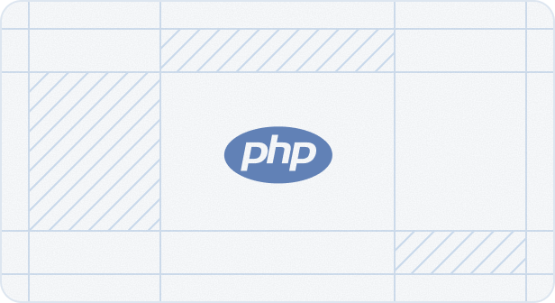
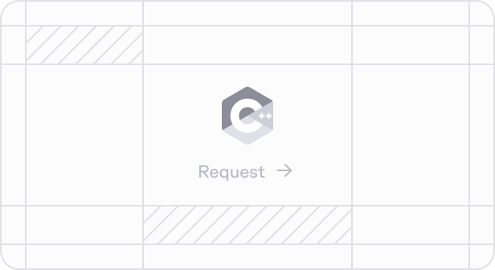
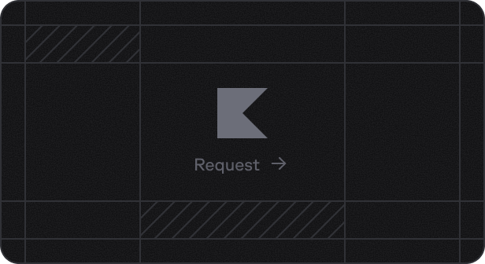

  {/* Dashed Pattern - Left Side */}
  

    {/* 

 */}
  

  {/* Dashed Pattern - Right Side */}
  

    {/* 

 */}
  

  <CardGroup cols={2}>
    <a class="fern-card interactive not-prose relative block p-6 text-base" href="/sdks/generators/type-script/quickstart">
      

        
        
        

          

            TypeScript
            
            
          

        

      

    </a>
    <a class="fern-card interactive not-prose relative block p-6 text-base" href="/sdks/generators/python/quickstart">
      

        
        
        

          

            Python
            
            
          

        

      

    </a>
    <a class="fern-card interactive not-prose relative block p-6 text-base" href="/sdks/generators/go/quickstart">
      

        
        
        

          

            Go
            
            
          

        

      

    </a>
    <a class="fern-card interactive not-prose relative block p-6 text-base" href="/sdks/generators/java/quickstart">
      

        
        
        

          

            Java
            
            
          

        

      

    </a>
    <a class="fern-card interactive not-prose relative block p-6 text-base" href="/sdks/generators/net/quickstart">
      

        
        
        

          

            .NET
            
            
          

        

      

    </a>
    <a class="fern-card interactive not-prose relative block p-6 text-base" href="/sdks/generators/php/quickstart">
      

        
        
        

          

            PHP
            
            
          

        

      

    </a>
    <a class="fern-card interactive not-prose relative block p-6 text-base" href="/sdks/generators/ruby/quickstart">
      

        
        
        

          

            Ruby
            
            
          

        

      

    </a>
    <a class="fern-card interactive not-prose relative block p-6 text-base" href="/sdks/generators/mcp-server">
      

        
        
        

          

            MCP Server
            
            
          

        

      

    </a>
    <a class="fern-card interactive not-prose relative block p-6 text-base" href="https://buildwithfern.com/book-demo?type=language-request">
      

        
        
        

          

            Rust
            
            
          

        

      

    </a>
    <a class="fern-card interactive not-prose relative block p-6 text-base" href="https://buildwithfern.com/book-demo?type=language-request">
      

        
        
        

          

            Swift
            
            
          

        

      

    </a>
    <a class="fern-card interactive not-prose relative block p-6 text-base" href="https://buildwithfern.com/book-demo?type=language-request">
      

        
        
        

          

            C++
            
            
          

        

      

    </a>

    <a class="fern-card interactive not-prose relative block p-6 text-base" href="https://buildwithfern.com/book-demo?type=language-request">
      

        
        
        

          

            Kotlin
            
            
          

        

      

    </a>
  </CardGroup> 
  

