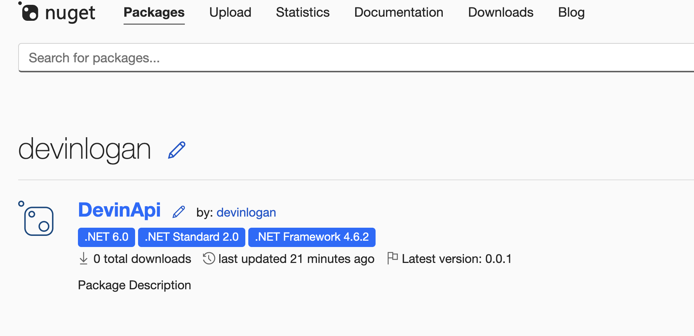
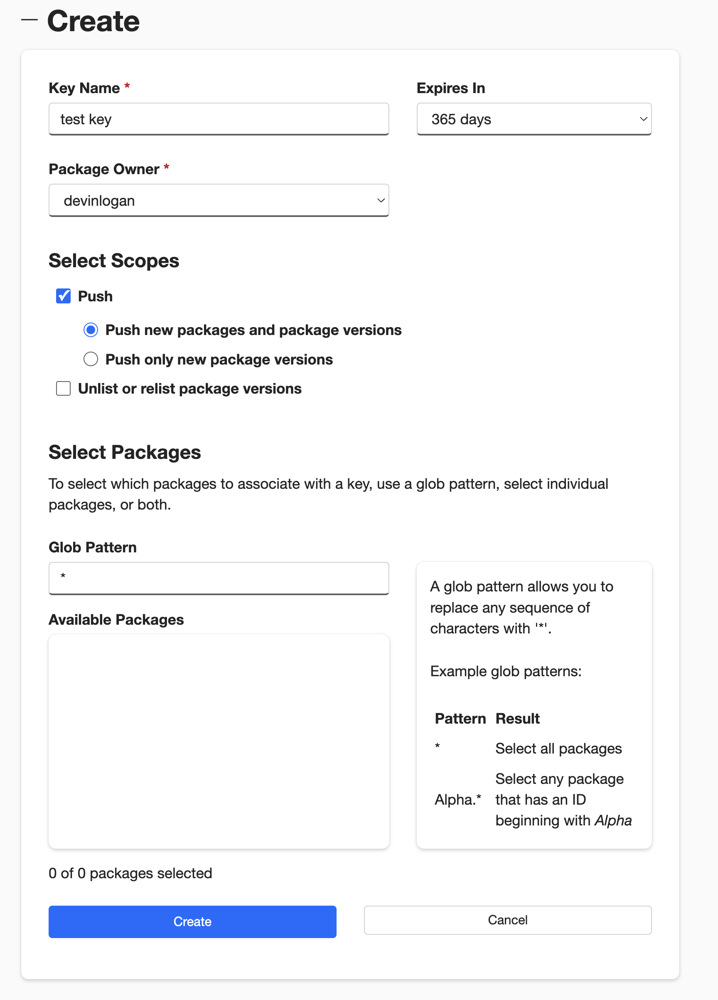

Publish your public-facing Fern C#/.NET SDK to the [NuGet
registry](https://www.nuget.org/). After following the steps on this page,
you'll have a versioned package published on NuGet.


<Frame>
	
</Frame>

<Info>This guide assumes that you already have an initialized `fern` folder on your local machine. If you don’t, run `fern init`. See [.NET Quickstart](quickstart.mdx) for more details.</Info>

## Set up your GitHub integration

  1.   Create a new GitHub repository called `company-csharp` (or something similar) for your SDK, if you haven't done so already.
  1.   Install the [Fern GitHub App](https://github.com/apps/fern-api): Select **Configure**, then scroll down to **Repository Access**. Select **Only select repositories** and in the dropdown select the repository for your SDK. Click **Save**. 


## Configure `generators.yml`

<Steps>

	<Step title="Run `fern add <generator>`">

	  Navigate to your `generators.yml` on your local machine. Your `generators.yml` lives inside of your `fern` folder and contains all the configuration for your Fern generators. 

	  Add a new generator to `generators.yml`:


	    ```bash
	    fern add fern-csharp-sdk --group csharp-sdk
	    ```

	  Once the command completes, you'll see a new group created in your `generators.yml`:

	  ```yaml {3-9}
	    groups:
	    ...
	      csharp-sdk:
	        generators:
	          - name: fernapi/fern-csharp-sdk
	            version: <Markdown src="/snippets/version-number.mdx"/>
	            output:
	              location: local-file-system
	              path: ../sdks/csharp
	    ```

	  </Step>

	  <Step title="Configure `output` location">

		Next, change the output location in `generators.yml` from `local-file-system` (the default) to `nuget` to indicate that Fern should publish your package directly to the NuGet registry:

	    ```yaml {6-7}
	    groups: 
	      csharp-sdk:
	        generators:
	          - name: fernapi/fern-csharp-sdk
	            version: <Markdown src="/snippets/version-number.mdx"/>
	            output:
	              location: nuget

	    ```
	  </Step>

	  <Step title="Add a unique package name">

	     Your package name must be unique in the NuGet repository, otherwise publishing your SDK to NuGet will fail. Update your package name if you haven't done so already:


```yaml {8}
groups: 
  csharp-sdk:
    generators:
      - name: fernapi/fern-csharp-sdk
        version: <Markdown src="/snippets/version-number.mdx"/>
        output:
          location: nuget
          package-name: your-package-name
```
	    
	  </Step>
	<Step title="Configure `client-class-name`">

	     The `client-class-name` option controls the name of the generated client. This is the name customers use to import your SDK (`import { your-client-name } from 'your-package-name';`). 


```yaml {9-10}
groups: 
  csharp-sdk:
    generators:
      - name: fernapi/fern-csharp-sdk
        version: <Markdown src="/snippets/version-number.mdx"/>
        output:
          location: nuget
          package-name: your-package-name
        config:
          client_class_name: YourClientName # must be PascalCase
```
	    
	  </Step>

	  <Step title="Add repository location">

	  Add the path to your GitHub repository to `generators.yml`: 

```yaml {11-12}
groups: 
  csharp-sdk:
    generators:
      - name: fernapi/fern-csharp-sdk
        version: <Markdown src="/snippets/version-number.mdx"/>
        output:
          location: nuget
          package-name: your-package-name
        config:
          client_class_name: YourClientName
        github: 
          repository: your-org/company-csharp
```
	  
	  </Step>
  </Steps>

## Set up NuGet publishing authentication

<Steps>

	<Step title="Log into NuGet">

	Log into [NuGet](https://nuget.org/) or create a new account. 

	</Step>

	<Step title="Add New Key">

	1.    Click on your profile picture. 
	1.    Select **API Keys**, then **Create**.
    1.    Name your key.
    1.    Select **Push > Push new packages and package versions** as the **Select Scopes** type.
    1.    Enter `*` under **Select Packages > Glob Patten**. 
            
            <Tip title="Replacing an existing NuGet package">
                If you are overriding an existing package, you can select the relevant
                package instead of entering `*`. 
            </Tip>
    1.    Click **Create**.

	<Frame>
	
	</Frame>

    <Warning>Save your new key –  it won’t be displayed after you leave the page.</Warning>

	</Step>

	<Step title="Configure NuGet authentication key">

	Add `api-key: ${NUGET_API_KEY}` to `generators.yml` to tell Fern to use the `NUGET_API_KEY` environment variable for authentication when publishing to the NuGet registry.

```yaml {9}
groups: 
  csharp-sdk:
    generators:
      - name: fernapi/fern-csharp-sdk
        version: <Markdown src="/snippets/version-number.mdx"/>
        output:
          location: nuget
          package-name: your-package-name
          api-key: ${NUGET_API_KEY}
        config:
          client_class_name: YourClientName
        github: 
          repository: your-org/company-csharp
```
	</Step>

</Steps>

## Release your SDK to NuGet

  At this point, you're ready to generate a release for your SDK.

<Steps>

	<Step title="Set NuGet environment variable">

	On your local machine, set the `NUGET_API_KEY` environment variable to the new API key you generated earlier:

	```bash
	export NUGET_API_KEY=your-actual-nuget-key
	```

	</Step>

	<Step title="Generate your release">

	Regenerate your SDK and publish it on NuGet:

	```bash
	fern generate --group csharp-sdk --version <version>
	```
    Local machine output will verify that the release is pushed to your
    repository and tagged with the version you specified. Log back into NuGet and
    navigate to **Packages** to see your new release. 
    </Step>

</Steps>