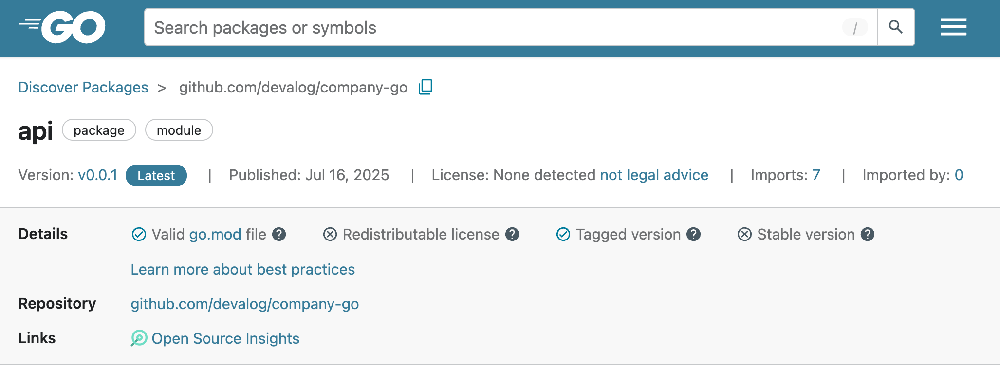

Publish your public-facing Fern GO SDK to the [Pkgsite
registry](https://pkg.go.dev/). After following the steps on this page,
you'll have a versioned package published on Pkgsite.

<Frame>
	
</Frame>

<Info>This guide assumes that you already have an initialized `fern` folder on your local machine. If you don’t, run `fern init`. See [Go Quickstart](quickstart.mdx) for more details.</Info>


## Set up your GitHub integration

  1.   Create a new GitHub repository called `company-go` (or something similar) for your SDK, if you haven't done so already. Make sure your repository has:
        *  **Public** visibility
        *  A required license (e.g. [MIT](https://opensource.org/license/mit), [Apache](https://www.apache.org/licenses/LICENSE-2.0)) to the repository.
  1.   Install the [Fern GitHub App](https://github.com/apps/fern-api): Select **Configure**, then scroll down to **Repository Access**. Select **Only select repositories** and in the dropdown select the repository for your SDK. Click **Save**. 
  

## Configure `generators.yml`

<Steps>

	<Step title="Run `fern add <generator>`">

	  Navigate to your `generators.yml` on your local machine. Your `generators.yml` lives inside of your `fern` folder and contains all the configuration for your Fern generators. 

	  Add a new generator to `generators.yml`:


	    ```bash
	    fern add fern-go-sdk --group go-sdk
	    ```

	  Once the command completes, you'll see a new group created in your `generators.yml`:

    ```yaml {2-11}
    groups:
      go-sdk:
      generators:
        - name: fernapi/fern-go-sdk
          version: <Markdown src="/snippets/version-number.mdx"/>
          output:
            location: local-file-system
            path: ../sdks/go
          config:
            module:
            path: sdk
    ```

	  </Step>

	  <Step title="Configure `output` location">

        Go publishes via Git repositories, so remove the auto-generated
        `output` and `config` properties. Instead, add the path to your
        GitHub repository: 

	    ```yaml {6-7}
	    groups: 
	      go-sdk:
	        generators:
	          - name: fernapi/fern-go-sdk
	            version: <Markdown src="/snippets/version-number.mdx"/>
	            github:
                  repository: devalog/company-go

	    ```
	  </Step>
	    
  </Steps>


## Release your SDK to Pkgsite

  At this point, you're ready to generate a release for your SDK.

<Steps>
 
	<Step title="Generate your release">

	Regenerate your SDK and publish it on PyPI:

	```bash
	fern generate --group go-sdk --version <version>
	```
    Local machine output will verify that the release is pushed to your
    repository and tagged with the version you specified. 

    </Step>

    <Step title="Publish on Pkgsite">
    
    Navigate to `https://pkg.go.dev/github.com/<github-org>/<github-repo-name>/` and send a request to index your package. In a few minutes, your new release should be published to [https://pkg.go.dev/](https://pkg.go.dev/)!

    <Tip>After releasing a new version, it may take a few minutes for Pkgsite
    to index and display the update. You can also try checking to see if the Go
    proxy has indexed your module at
    `https://proxy.golang.org/github.com/<github-org>/<github-repo-name>/@v/list`. Pkgsite
    indexing usually happens within 5-15 min of the proxy picking it up. For
    more information, see Go's documentation on [Adding a
    package](https://pkg.go.dev/about#adding-a-package). </Tip> 
    
    </Step>

</Steps>
