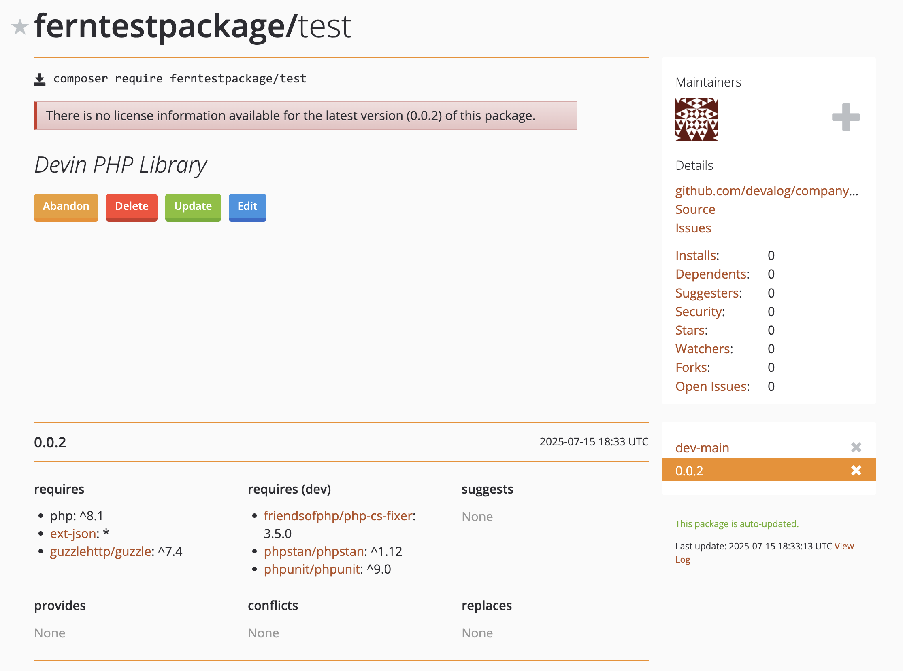
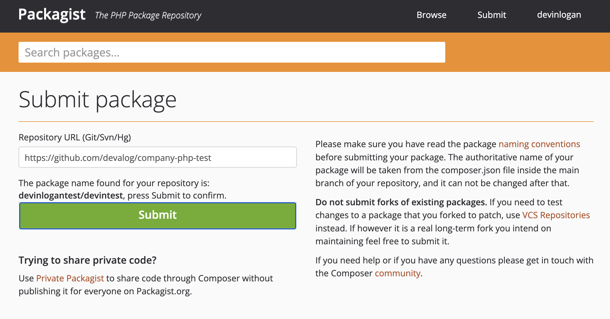
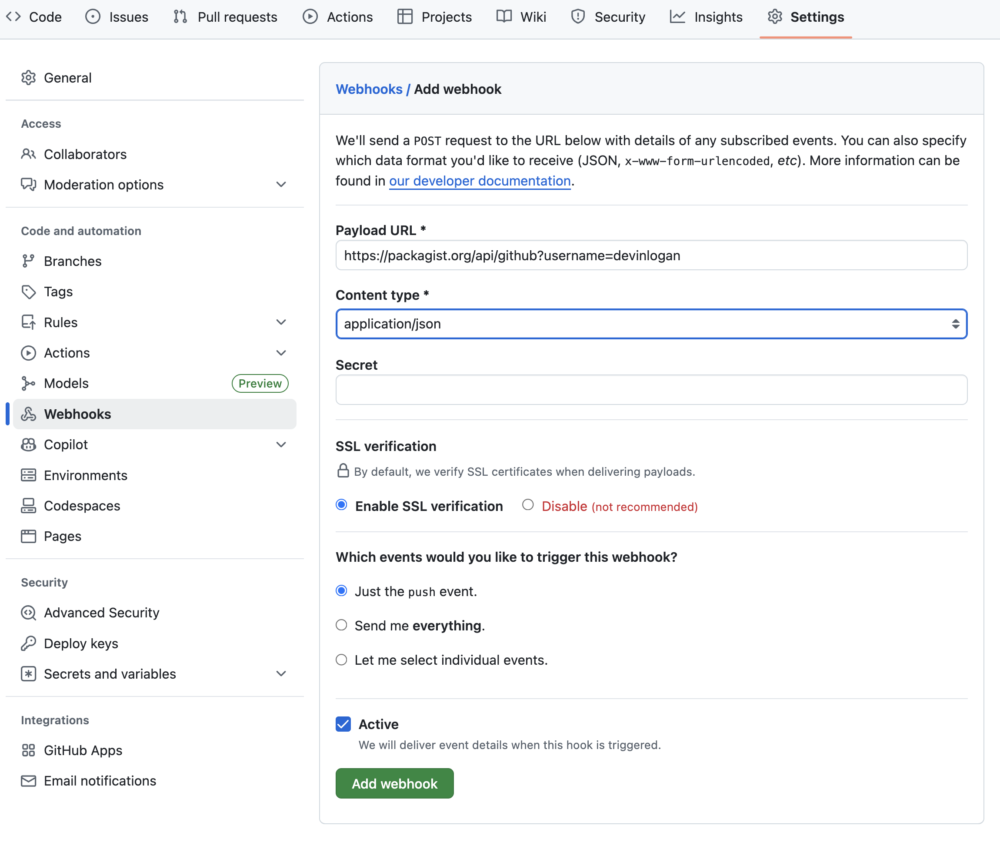

Publish your public-facing Fern PHP SDK to the [Packagist
registry](https://packagist.org/). After following the steps on this page,
you'll have a versioned package published on Packagist.

<Frame>
	
</Frame>

<Info>This guide assumes that you already have an initialized `fern` folder on your local machine. If you don’t, run `fern init`. See [PHP Quickstart](quickstart.mdx) for more details.</Info>

## Set up your GitHub integration

  1. Create a new GitHub repository called `company-php` (or something similar) for your SDK, if you haven't done so already.
        <Warning>
        Your repository must:
        * Have **public** visibility. You can configure this in your repository's
        **Settings**. 
        * Have a `composer.json` file in your main branch that adheres to Packagist's
        requirements. See Packagist's [Getting
        Started](https://packagist.org/) and [Naming
        Conventions](https://packagist.org/about#naming-your-package) documentation.
        </Warning>
  1. Install the [Fern GitHub App](https://github.com/apps/fern-api): Select **Configure**, then scroll down to **Repository Access**. Select **Only select repositories** and in the dropdown select the repository for your SDK. Click **Save**. 


## Configure `generators.yml`

<Steps>

	<Step title="Run `fern add <generator>`">

	  Navigate to your `generators.yml` on your local machine. Your `generators.yml` lives inside of your `fern` folder and contains all the configuration for your Fern generators. 

	  Add a new generator to `generators.yml`:


	    ```bash
	    fern add fern-php-sdk --group php-sdk
	    ```

	  Once the command completes, you'll see a new group created in your `generators.yml`:

	  ```yaml {2-8}
      groups: 
        php-sdk:
          generators:
            - name: fernapi/fern-php-sdk
              version: <Markdown src="/snippets/version-number.mdx"/>
	          output:
	            location: local-file-system
	            path: ../sdks/php
	    ```

	  </Step>


	  <Step title="Add repository location">

	  PHP publishes via Git repositories, so remove the auto-generated `output`, `location`, and `path` fields. Instead, add the path to your GitHub repository: 

```yaml {6-7}
groups: 
  php-sdk:
    generators:
      - name: fernapi/fern-php-sdk
        version: <Markdown src="/snippets/version-number.mdx"/>
        github: 
          repository: your-org/company-php
```
	  
	  </Step>
  </Steps>


## Set up Packagist publishing authentication 

<Steps>
<Step title="Log into Packagist">

Log into [Packagist](https://packagist.org/login/) or [create an account with Packagist](https://packagist.org/register/).

</Step>
<Step title="Submit the Repository URL">

1. Click **Submit**.
1. Input the full URL of the repository where you generated your PHP SDK, then click **Check**.
1. Fix any errors Packagist finds in your repository, then click **Submit**. 

<Frame>
	
</Frame>

</Step>

<Step title="Configure the GitHub Hook">

Once you've submitted your URL, you'll be prompted to set up the GitHub Hook.

  1. In to your repository, go to **Settings > Webhooks**. 
  1. Select **"Add webhook"** 
  1. Set the Payload URL as `https://packagist.org/api/github?username=<your.packagist.username>`
  1. Set the content type as `application/json`
  1. Packagist autogenerates API Tokens. To find yours, go to your **Profile**. Then, add your token to the **Secret** field. 
  1. Set the trigger events as **Just the `push` event**
  1. Click **"Add Webhook"**
    <Frame>
	
</Frame>
</Step>
</Steps>

## Release your SDK to Packagist

  At this point, you're ready to regenerate your SDK and publish it on Packagist:

	```bash
	fern generate --group php-sdk --version <version>
	```
    Local machine output will verify that the release is pushed to your
    repository and tagged with the version you specified. Log back into Packagist, click on your username, and select **My packages** to see your new release. 
  
