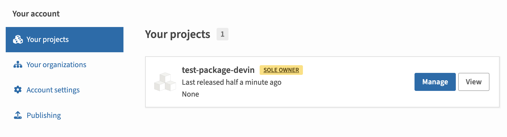
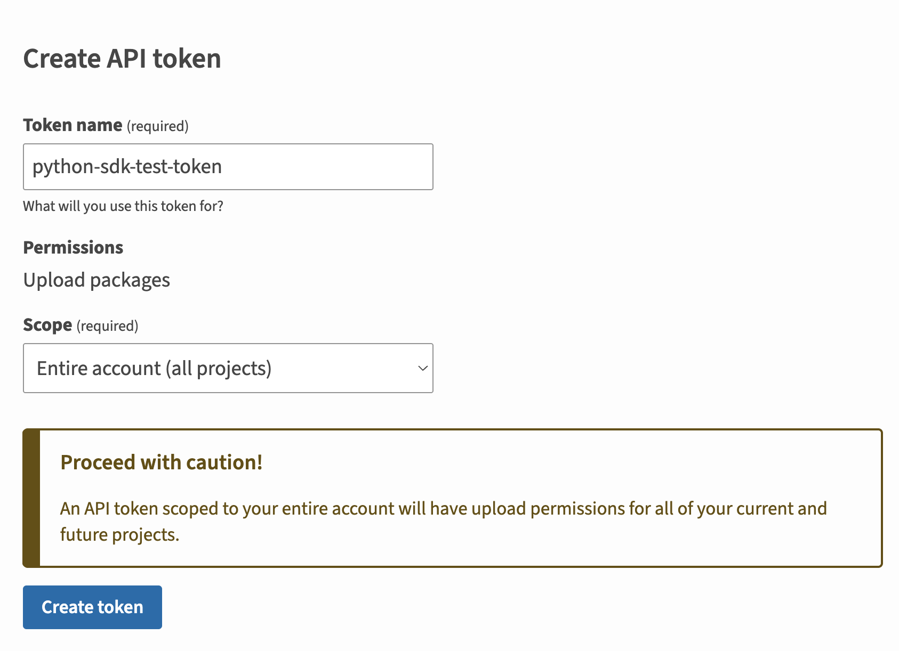

Publish your public-facing Fern Python SDK to the [PyPI
registry](https://pypi.org/). After following the steps on this page,
you'll have a versioned package published on PyPI.

<Frame>
	
</Frame>

<Markdown src="/products/sdks/snippets/setup-fern-folder-callout.mdx"/>

## Set up your GitHub integration

  1.   Create a new GitHub repository called `company-python` (or something similar) for your SDK, if you haven't done so already.
  1.   Install the [Fern GitHub App](https://github.com/apps/fern-api): Select **Configure**, then scroll down to **Repository Access**. Select **Only select repositories** and in the dropdown select the repository for your SDK. Click **Save**. 
  

## Configure `generators.yml`

<Steps>

	<Step title="Run `fern add <generator>`">

	  Navigate to your `generators.yml` on your local machine. Your `generators.yml` lives inside of your `fern` folder and contains all the configuration for your Fern generators. 

	  Add a new generator to `generators.yml`:


	    ```bash
	    fern add fern-python-sdk --group python-sdk
	    ```

	  Once the command completes, you'll see a new group created in your `generators.yml`:

	  ```yaml {3-9}
	    groups:
	    ...
	      python-sdk:
	        generators:
	          - name: fernapi/fern-python-sdk
	            version: <Markdown src="/snippets/version-number-python.mdx"/>
	            output:
	              location: local-file-system
	              path: ../sdks/python
	    ```

	  </Step>

	  <Step title="Configure `output` location">

		Next, change the output location in `generators.yml` from `local-file-system` (the default) to `pypi` to indicate that Fern should publish your package directly to the PyPI registry:

	    ```yaml title="Python" {6-7}
	    groups: 
	      python-sdk:
	        generators:
	          - name: fernapi/fern-python-sdk
	            version: <Markdown src="/snippets/version-number-python.mdx"/>
	            output:
	              location: pypi

	    ```
	  </Step>

	  <Step title="Add a unique package name">

	     Your package name must be unique in the PyPI repository, otherwise publishing your SDK to PyPI will fail. Update your package name if you haven't done so already:


```yaml title="Python" {8}
groups: 
  python-sdk:
    generators:
      - name: fernapi/fern-python-sdk
        version: <Markdown src="/snippets/version-number-python.mdx"/>
        output:
          location: pypi
          package-name: your-package-name
```
	    
	  </Step>

	<Step title="Configure `client-class-name`">

	     The `client-class-name` option controls the name of the generated client. This is the name customers use to import your SDK (`import { your-client-name } from 'your-package-name';`). 


```yaml title="Python" {9-10}
groups: 
  python-sdk:
    generators:
      - name: fernapi/fern-python-sdk
        version: <Markdown src="/snippets/version-number-python.mdx"/>
        output:
          location: pypi
          package-name: your-package-name
        config:
          client_class_name: YourClientName # must be PascalCase
```
	    
	  </Step>

	  <Step title="Add repository location">

	  Add the path to your GitHub repository to `generators.yml`: 

```yaml title="Python" {11-12}
groups: 
  python-sdk:
    generators:
      - name: fernapi/fern-python-sdk
        version: <Markdown src="/snippets/version-number-python.mdx"/>
        output:
          location: pypi
          package-name: your-package-name
        config:
          client_class_name: YourClientName
        github: 
          repository: your-org/company-python
```
	  
	  </Step>
  </Steps>

## Set up PyPi publishing authentication

<Steps>

	<Step title="Log into PyPi">

	Log into [PyPi](https://pypi.org/) or create a new account. 

	</Step>

	<Step title="Navigate to Account settings">

	1.    Click on your profile picture. 
	1.    Select **Account settings**.
	1.    Scroll down to **API Tokens**. 

	</Step>

	<Step title="Add New Token">

	1.    Click on **Add API Token**
  	1.    Name your token and set the scope to the relevant projects.
    1.    Click **Create token**

	<Frame>
	
	</Frame>

    <Warning>Save your new token –  it won’t be displayed after you leave the page.</Warning>

	</Step>

	<Step title="Configure PyPI authentication token">

	Add `token: ${PYPI_TOKEN}` to `generators.yml` to tell Fern to use the `PYPI_TOKEN` environment variable for authentication when publishing to the PyPI registry.

```yaml title="Python" {9}
groups: 
  python-sdk:
    generators:
      - name: fernapi/fern-python-sdk
        version: <Markdown src="/snippets/version-number-python.mdx"/>
        output:
          location: pypi
          package-name: your-package-name
          token: ${PYPI_TOKEN}
        config:
          client_class_name: YourClientName
        github: 
          repository: your-org/company-python
```
	</Step>

</Steps>

## Release your SDK to PyPI

  At this point, you're ready to generate a release for your SDK.

<Steps>
 
	<Step title="Set PyPI environment variable">

	On your local machine, set the `PYPI_TOKEN` environment variable to the new API token you generated earlier:

	```bash
	export PYPI_TOKEN=your-actual-pypi-token
	```

	</Step>

	<Step title="Generate your release">

	Regenerate your SDK and publish it on PyPI:

	```bash
	fern generate --group python-sdk --version <version>
	```
    Local machine output will verify that the release is pushed to your
    repository and tagged with the version you specified. Log back into PyPI and
    navigate to **Your projects** to see your new release. 
    </Step>

</Steps>