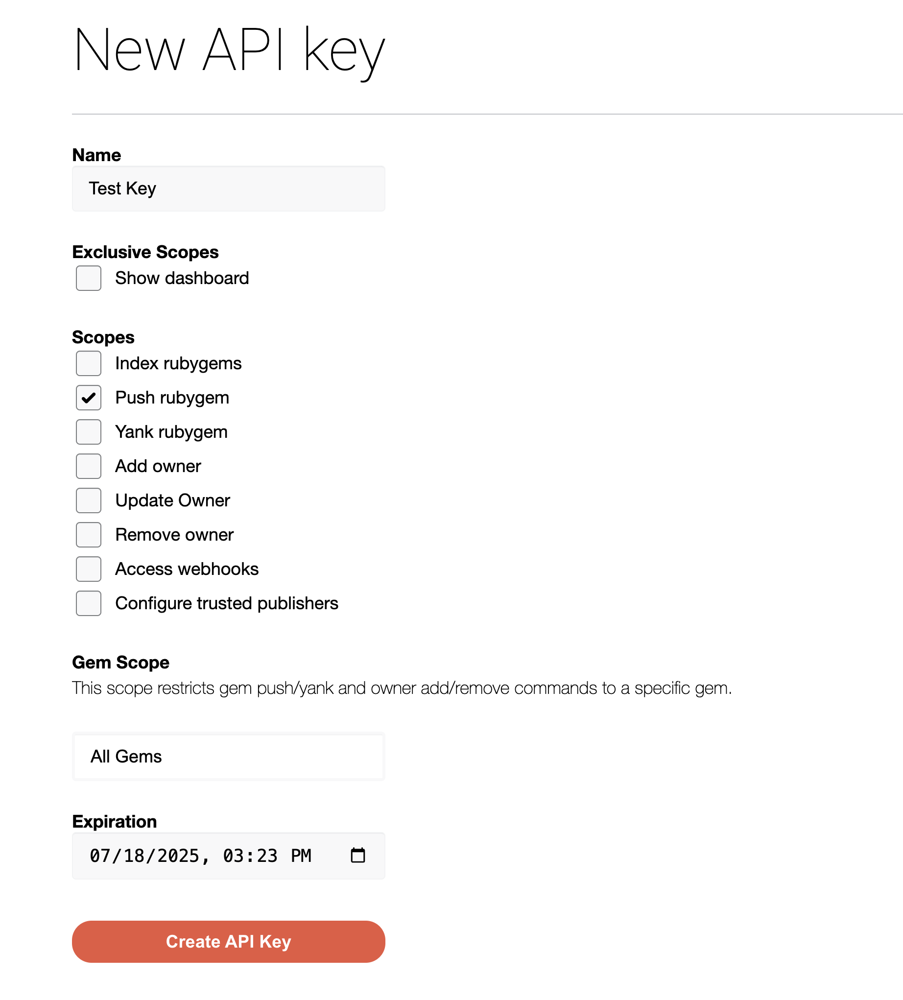

Publish your public-facing Fern Ruby SDK to the [RubyGems
registry](https://rubygems.org/). After following the steps on this page,
you'll have a versioned package published on RubyGems.

<Info>This guide assumes that you already have an initialized `fern` folder on your local machine. If you don’t, run `fern init`. See [Ruby Quickstart](quickstart.mdx) for more details.</Info>

## Set up your GitHub integration

  1.   Create a new GitHub repository called `company-ruby` (or something similar) for your SDK, if you haven't done so already.
  1.   Install the [Fern GitHub App](https://github.com/apps/fern-api): Select **Configure**, then scroll down to **Repository Access**. Select **Only select repositories** and in the dropdown select the repository for your SDK. Click **Save**. 


## Configure `generators.yml`

<Steps>

	<Step title="Run `fern add <generator>`">

	  Navigate to your `generators.yml` on your local machine. Your `generators.yml` lives inside of your `fern` folder and contains all the configuration for your Fern generators. 

	  Add a new generator to `generators.yml`:


	    ```bash
	    fern add fern-ruby-sdk --group ruby-sdk
	    ```

	  Once the command completes, you'll see a new group created in your `generators.yml`:

	  ```yaml {3-9}
	    groups:
	    ...
	      ruby-sdk:
	        generators:
	          - name: fernapi/fern-ruby-sdk
	            version: <Markdown src="/snippets/version-number.mdx"/>
	            output:
	              location: local-file-system
	              path: ../sdks/ruby
	    ```

	  </Step>

	  <Step title="Configure `output` location">

		Next, change the output location in `generators.yml` from `local-file-system` (the default) to `pypi` to indicate that Fern should publish your package directly to the PyPI registry:

	    ```yaml {6-7}
	    groups: 
	      ruby-sdk:
	        generators:
	          - name: fernapi/fern-ruby-sdk
	            version: <Markdown src="/snippets/version-number.mdx"/>
	            output:
	              location: rubygems

	    ```
	  </Step>

	  <Step title="Add a unique package name">

	     Your package name must be unique in the RubyGems repository, otherwise publishing your SDK to RubyGems will fail. Update your package name if you haven't done so already:


```yaml {8}
groups: 
  ruby-sdk:
    generators:
      - name: fernapi/fern-ruby-sdk
        version: <Markdown src="/snippets/version-number.mdx"/>
        output:
          location: rubygems
          package-name: your-package-name
```
	    
	  </Step>
	<Step title="Configure `clientClassName`">

	     The `clientClassName` option controls the name of the generated client. This is the name customers use to import your SDK (`import { your-client-name } from 'your-package-name';`). 


```yaml {9-10}
groups: 
  ruby-sdk:
    generators:
      - name: fernapi/fern-ruby-sdk
        version: <Markdown src="/snippets/version-number.mdx"/>
        output:
          location: rubygems
          package-name: your-package-name
        config:
          clientClassName: YourClientName # must be PascalCase
```
	    
	  </Step>

	  <Step title="Add repository location">

	  Add the path to your GitHub repository to `generators.yml`: 

```yaml {11-12}
groups: 
  ruby-sdk:
    generators:
      - name: fernapi/fern-ruby-sdk
        version: <Markdown src="/snippets/version-number.mdx"/>
        output:
          location: rubygems
          package-name: your-package-name
        config:
          clientClassName: YourClientName
        github: 
          repository: your-org/company-ruby
```
	  
	  </Step>
  </Steps>

## Set up RubyGems publishing authentication

<Steps>

	<Step title="Log into RubyGems">

	Log into [RubyGems](https://rubygems.org/) or create a new account. 

	</Step>

	<Step title="Navigate to Account settings">

    1. Click on your profile picture
    1. Select **Settings**. 
    1. Scroll down and click on **API Keys**. 

	</Step>

	<Step title="Add New Key">

	When prompted to [create a new API key](https://rubygems.org/profile/api_keys/new):
    1. Name your key. 
    1. Under **Scopes**, select **Push rubygem**
    1. Select `All Gems` under **Gem Scope**. 
  <Tip title="Replacing an existing gem">
    If you are overriding an existing gem, you can select the relevant package instead of entering `All Gems`. 
  </Tip>
    1. Set an expiration date. 
    1. Click **Create API Key**. 

	<Warning>Save your new key –  it won’t be displayed after you leave the page.</Warning>

	<Frame>
	
	</Frame>

	</Step>

	<Step title="Configure RubyGems authentication token">

	Add `api-key: ${RUBYGEMS_API_KEY}` to `generators.yml` to tell Fern to use the `RUBYGEMS_API_KEY` environment variable for authentication when publishing to the PyPI registry.

```yaml title="ruby" {9}
groups: 
  ruby-sdk:
    generators:
      - name: fernapi/fern-ruby-sdk
        version: <Markdown src="/snippets/version-number.mdx"/>
        output:
          location: rubygems
          package-name: your-package-name
          api-key: ${RUBYGEMS_API_KEY}
        config:
          clientClassName: YourClientName
        github: 
          repository: your-org/company-ruby
```
	</Step>

</Steps>

## Release your SDK to RubyGems

  At this point, you're ready to generate a release for your SDK.

<Steps>

	<Step title="Set RubyGems environment variable">

	On your local machine, set the `RUBYGEMS_API_KEY` environment variable to the new API key you generated earlier:

	```bash
	export RUBYGEMS_API_KEY=your-actual-rubygems-token
	```

	</Step>

	<Step title="Generate your release">

	Regenerate your SDK and publish it on RubyGems:

	```bash
	fern generate --group ruby-sdk --version <version>
	```
    Local machine output will verify that the release is pushed to your
    repository and tagged with the version you specified. Log back into RubyGems and
    navigate to **Releases** to see your new release. 
    </Step>

</Steps>