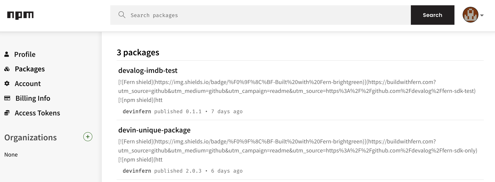
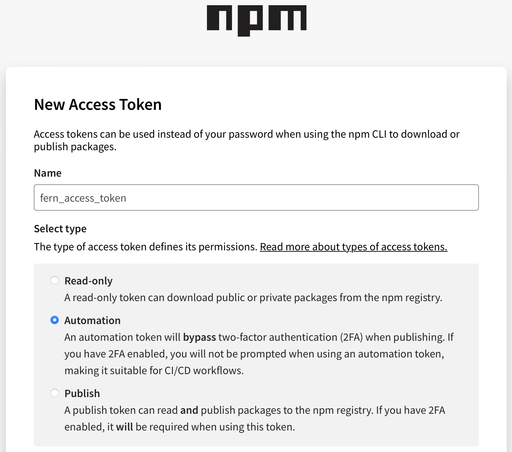
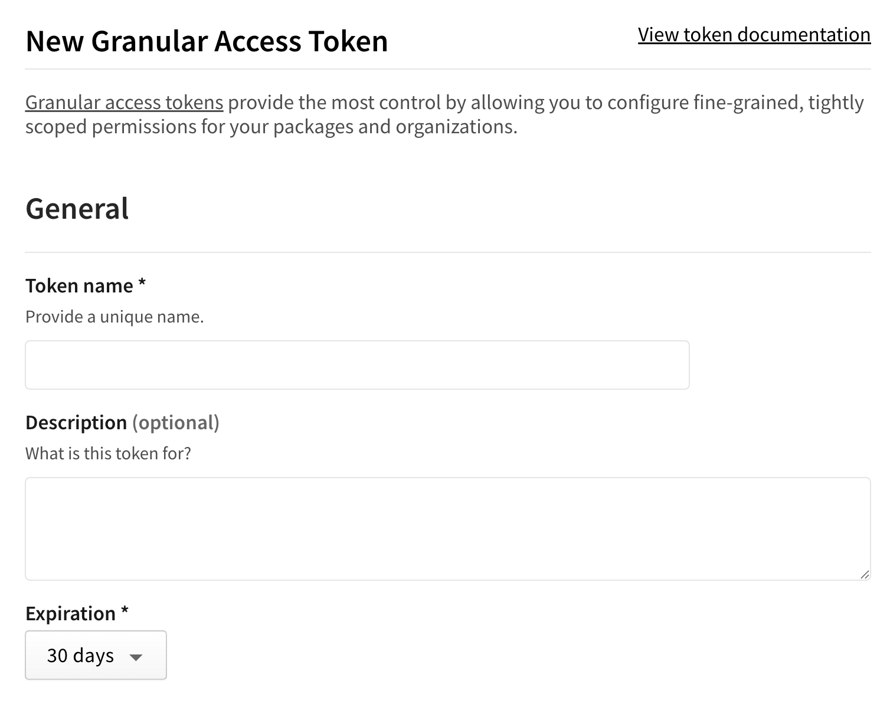
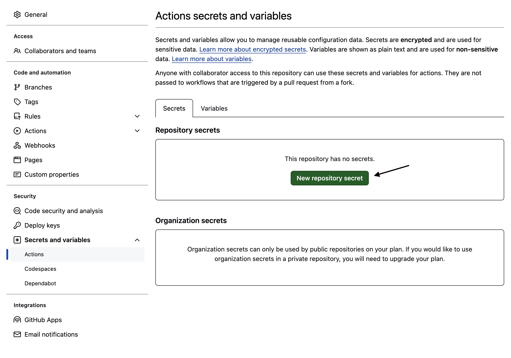
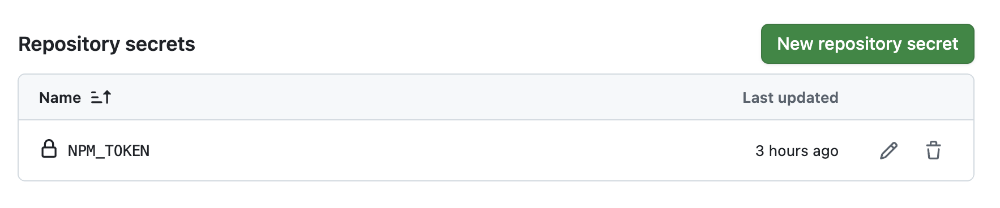

Publish your public-facing Fern TypeScript SDK to the [npm
registry](https://www.npmjs.com/). After following the steps on this page,
you'll have a versioned package published on npm.

<Frame>
	
</Frame>

<Info>
	This page assumes that you have:

	* An initialized `fern` folder on your local machine. See [Set up the `fern`
	folder](/sdks/overview/quickstart).
	* A GitHub repository for your TypeScript SDK. See [Set up your GitHub structure](/sdks/overview/github).
	* A TypeScript generator group in `generators.yml`. See [TypeScript
	Quickstart](quickstart#add-the-sdk-generator).

  </Info>

## Configure `generators.yml`

<Steps>

	  <Step title="Configure `output` location">

		In the `group` for your TypeScript SDK, change the output location in from `local-file-system` (the default) to `npm` to indicate that Fern should publish your package directly to the npm registry:

	    ```yaml {6-7}
	    groups: 
	      ts-sdk: # Group name for your TypeScript SDK
	        generators:
	          - name: fernapi/fern-typescript-sdk
	            version: <Markdown src="/snippets/typescript-sdk-version.mdx"/>
	            output:
	              location: npm

	    ```
	  </Step>

	  <Step title="Add a unique package name">

	     Your package name must be unique in the npm repository, otherwise publishing your SDK to npm will fail. Update your package name if you haven't done so already:


```yaml {8}
groups: 
  ts-sdk:
    generators:
      - name: fernapi/fern-typescript-sdk
        version: <Markdown src="/snippets/typescript-sdk-version.mdx"/>
        output:
          location: npm
          package-name: your-package-name
```
	    
	  </Step>

	<Step title="Configure `namespaceExport`">

	     The `namespaceExport` option controls the name of the generated client. This is the name customers use to import your SDK (`import { your-client-name } from 'your-package-name';`). 


```yaml {9-10}
groups: 
  ts-sdk:
    generators:
      - name: fernapi/fern-typescript-sdk
        version: <Markdown src="/snippets/typescript-sdk-version.mdx"/>
        output:
          location: npm
          package-name: your-package-name
        config:
          namespaceExport: YourClientName # must be PascalCase
```
	    
	  </Step>

	  <Step title="Add repository location">

	  Add the path to your GitHub repository to `generators.yml`, if you haven't already:

```yaml {11-12}
groups: 
  ts-sdk:
    generators:
      - name: fernapi/fern-typescript-sdk
        version: <Markdown src="/snippets/typescript-sdk-version.mdx"/>
        output:
          location: npm
          package-name: your-package-name
        config:
           namespaceExport: YourClientName
        github: 
          repository: your-org/company-typescript
```
	  
	  </Step>
  </Steps>

## Generate an npm token

<Steps>

	<Step title="Log into npm">

	Log into [npm](https://www.npmjs.com/) or create a new account. 

	</Step>

	<Step title="Navigate to Access Tokens">

	1.    Click on your profile picture. 
	1.    Select **Edit Profile**.
	1.    Select **Access Tokens**. 

	</Step>

	<Step title="Generate Token">

	Click on **Generate New Token**, then choose the appropriate token type. 
	
	<Info>For more information on access tokens and which type to choose, see npm's [About access tokens](https://docs.npmjs.com/about-access-tokens) documentation. </Info>

	<AccordionGroup>
  <Accordion title="Option 1: Classic Token">

  	1.    Select **Classic Token**
  	1.    Name your token and select **Automation** as the token type. 
	1.    Click **Generate Token**.

	<Warning>Save your new token –  it won’t be displayed after you leave the page.</Warning>

	<Frame>
	
	</Frame>

  </Accordion>
  <Accordion title="Option 2: Granular Access Token">
	1.    Select **Granular Access Token**. 
	1.    Name your token.
	1.    Set an expiration.
	1.    Configure your token's access to packages and scopes.
	1.    Configure your token's access to organizations. In order to fill this out, you must have at least one organization already configured in npm. See [Creating an organization](https://docs.npmjs.com/creating-an-organization) for more information.
	1.    Optionally fill out additional permissions according to your organization's requirements. 
	1.    Click **Generate Token**.

	<Warning>Save your new token –  it won’t be displayed after you leave the page.</Warning>

	<Frame>
	
	</Frame>

	</Accordion>
	</AccordionGroup>
	
	</Step>

</Steps>

## Configure npm authentication

<AccordionGroup>
<Accordion title="Option 1: Configure authentication via GitHub Actions">

Use [GitHub Actions](https://docs.github.com/en/actions/get-started/quickstart) to automatically publish new SDK versions to npm when you push code changes. 

<Steps>

	<Step title="Navigate to Actions in Settings">

	Open your Fern repository in GitHub. Click on the **Settings** tab in your repository. Then, under the **Security** section, open **Secrets and variables** > **Actions**. 

	<Frame>
	
	</Frame>

	You can also use the url `https://github.com/<your-repo>/settings/secrets/actions`.

	</Step>

	<Step title="Add secret for your npm Token">

	1.    Select **New repository secret**. 
	1.    Name your secret `NPM_TOKEN`.
	1.    Add the corresponding token you generated above.
	1.    Click **Add secret**. 

	<Frame>
	
	</Frame>

	</Step>

	<Step title="Allow GitHub to run workflows">

		Change your workflow permissions to allow GitHub to run workflows:

		1.    Click on the **Settings** tab in your repository. 
		1.    Under the **Code and automation** section, navigate to **Actions** > **General**. 
        1.    Under **Actions permissions**, select **Allow all actions and reusable workflows**.
		1.    **Save** your settings. Now GitHub can run the actions you configure. 

	</Step>
	<Step title="Add token to `generators.yml`">

	Add `token: ${NPM_TOKEN}` to `generators.yml` to tell Fern to use the `NPM_TOKEN` environment variable (which you just configured in your GitHub repo) for authentication when publishing to the npm registry.

	```yaml {9}
	groups: 
	ts-sdk:
		generators:
		- name: fernapi/fern-typescript-sdk
		  version: <Markdown src="/snippets/typescript-sdk-version.mdx"/>
		  output:
			location: npm
			package-name: name-of-your-package
			token: ${NPM_TOKEN}
		  config:
			namespaceExport: YourClientName
		  github: 
			repository: your-org/your-repository
	```

	When you regenerate your release, Fern will automatically create a workflow in your repository called `.github/workflows/ci.yml` that will automatically publish your release to npm. For an example, see Vapi's [npm publishing GitHub Action](https://github.com/VapiAI/server-sdk-typescript/blob/main/.github/workflows/ci.yml)
	</Step>
</Steps>

</Accordion>
<Accordion title="Option 2: Configure via environment variables">
<Steps>
	<Step title="Configure npm authentication token">

	Add `token: ${NPM_TOKEN}` to `generators.yml` to tell Fern to use the `NPM_TOKEN` environment variable for authentication when publishing to the npm registry.

```yaml {9}
groups: 
  ts-sdk:
    generators:
      - name: fernapi/fern-typescript-sdk
        version: <Markdown src="/snippets/typescript-sdk-version.mdx"/>
        output:
          location: npm
          package-name: name-of-your-package
          token: ${NPM_TOKEN}
        config:
          namespaceExport: YourClientName
        github: 
          repository: your-org/your-repository
```
	</Step>
	<Step title="Set npm environment variable">

	Set the `NPM_TOKEN` environment variable on your local machine:

	```bash
	export NPM_TOKEN=your-actual-npm-token
	```

	</Step>
</Steps>
</Accordion>
</AccordionGroup>


## Release your SDK to npm

	Regenerate your SDK and publish it on npm:

	```bash
	fern generate --group ts-sdk --version <version>
	```
	Local machine output will verify that the release is pushed to your
    repository and tagged with the version you specified. Log back into npm and
    navigate to **Packages** to see your new release. 